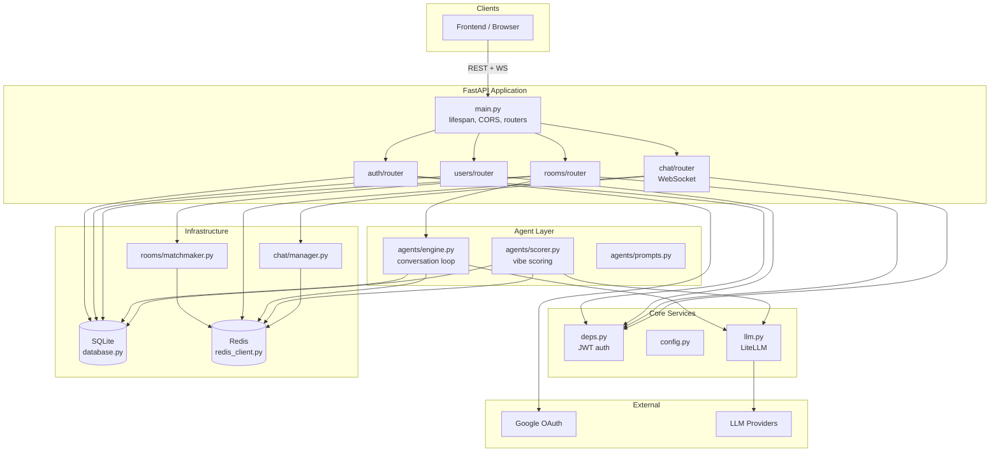
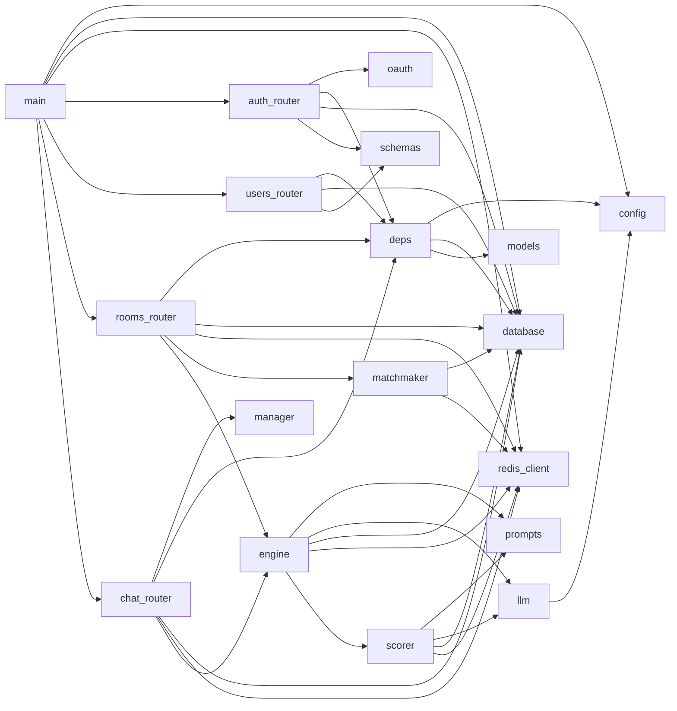
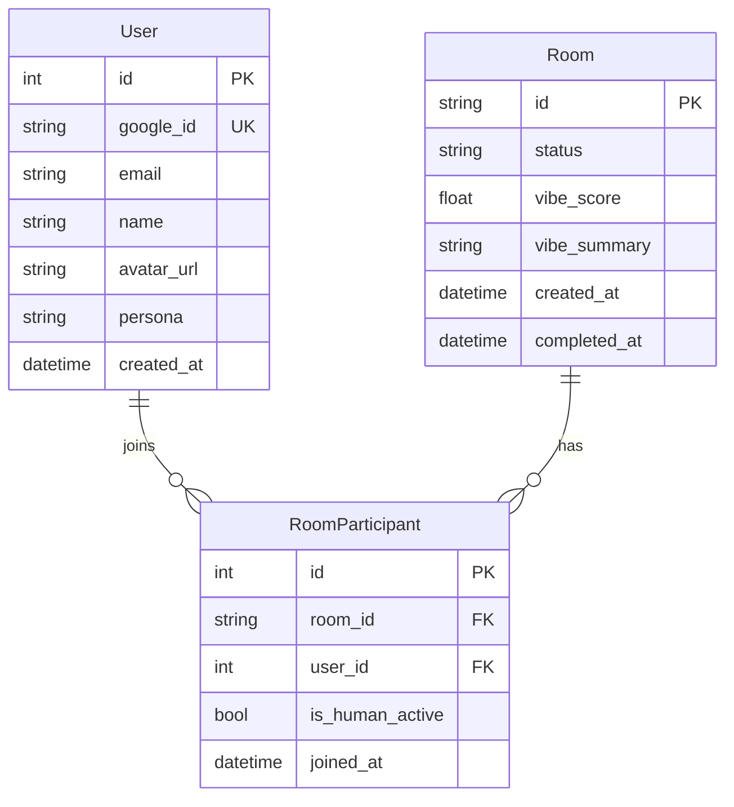
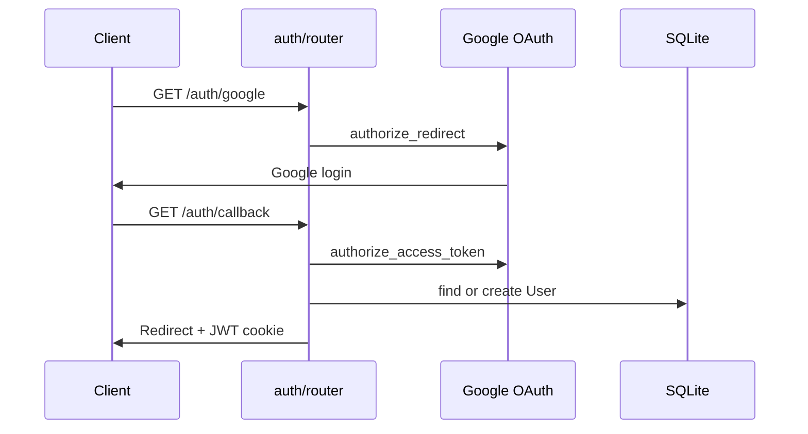
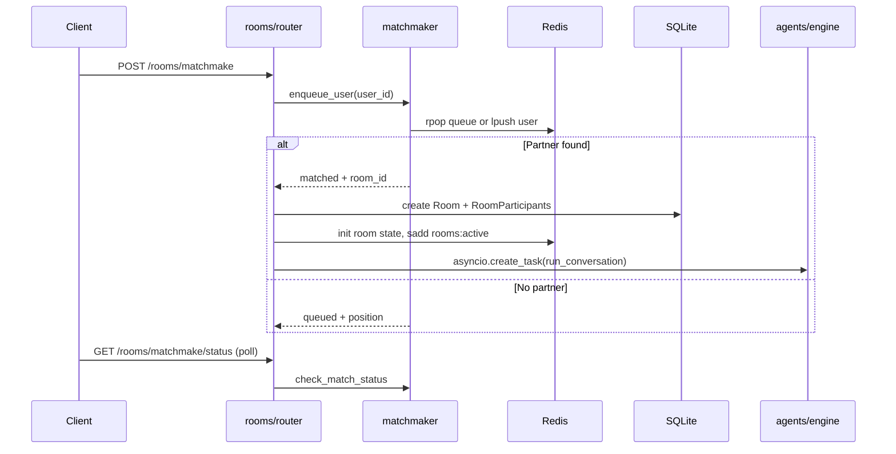
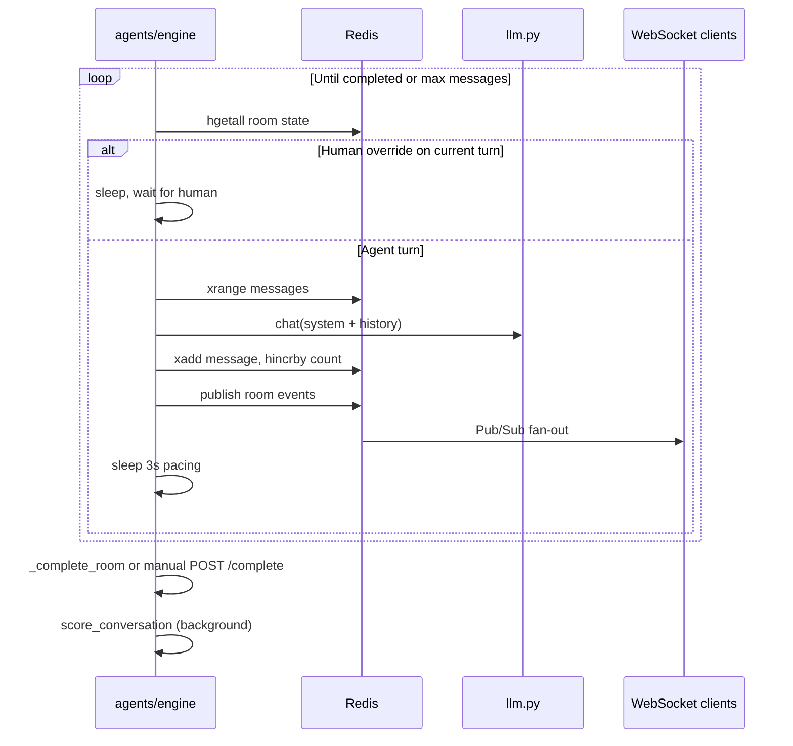
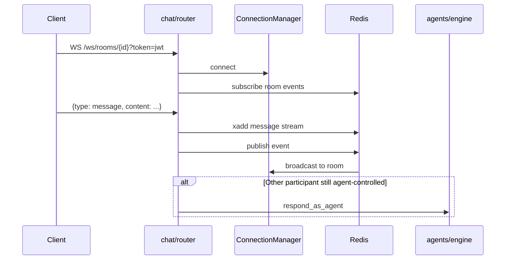
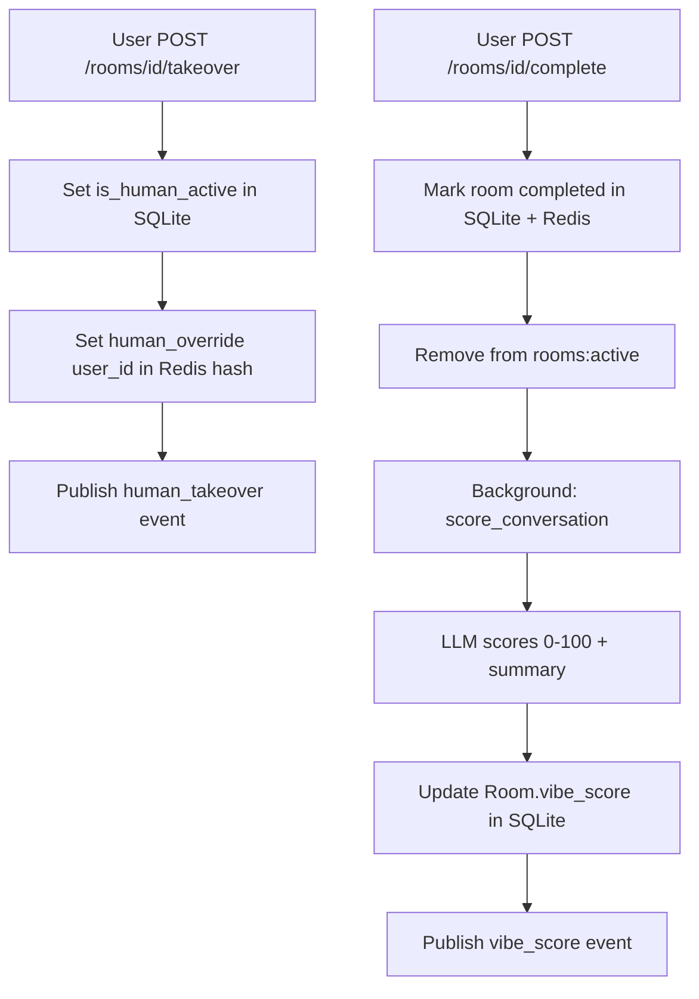

# Twinder Backend

FastAPI backend for Twinder: digital twins that network on your behalf. Users authenticate, define a persona, get matched into rooms, and their AI twins converse while humans can watch, take over, or complete conversations for vibe scoring.

## Tech Stack

| Layer | Technology |
|-------|------------|
| API | FastAPI + uvicorn (async Python 3.11+) |
| Persistence | SQLModel / SQLite (`User`, `Room`, `RoomParticipant`) |
| Real-time state | Redis (Streams, Pub/Sub, Hashes, Lists, Sets) |
| LLM | LiteLLM (Anthropic, OpenAI, 100+ providers via env) |
| Auth | Google OAuth (Authlib) + JWT (cookie or Bearer) |

## Architecture Overview



## Module Map

```
app/
├── main.py              Entry point, lifespan, middleware, router registration
├── config.py            Pydantic Settings from .env
├── deps.py              get_current_user (JWT from cookie or Authorization header)
├── database.py          SQLModel engine, create_db, get_session
├── models.py            User, Room, RoomParticipant
├── schemas.py           Pydantic request/response models
├── redis_client.py      Async Redis pool (RESP2/3 auto-fallback)
├── llm.py               LiteLLM wrapper (provider-agnostic)
│
├── auth/
│   ├── oauth.py         Authlib Google OAuth client
│   └── router.py        /auth/google, /callback, /me, /logout, /dev-login
│
├── users/
│   └── router.py        /users/me, /users/{id}
│
├── rooms/
│   ├── router.py        Room CRUD, matchmaking, takeover, completion
│   └── matchmaker.py    Redis list-based pairing queue
│
├── chat/
│   ├── manager.py       In-memory WebSocket ConnectionManager
│   └── router.py        WS /ws/rooms/{room_id}
│
└── agents/
    ├── prompts.py       Twin persona + vibe scoring prompts
    ├── engine.py        Agent conversation loop + respond_as_agent
    └── scorer.py        Post-conversation vibe scoring
```

### Dependency Graph



## Data Model

### SQLite (durable records)



### Redis (ephemeral + real-time)

| Key | Type | Purpose |
|-----|------|---------|
| `matchmaking:queue` | List | User IDs waiting to be paired |
| `matchmaking:result:{user_id}` | String | Matched `room_id` (TTL 5 min) |
| `room:{id}:messages` | Stream | Full message history |
| `room:{id}:state` | Hash | Status, turn, message count, human overrides |
| `room:{id}:events` | Pub/Sub | Fan-out to WebSocket clients |
| `rooms:active` | Set | Active room IDs |

## Request Flows

### 1. Authentication



Dev shortcut: `POST /auth/dev-login?name=...&persona=...` creates a test user and returns a JWT without Google.

### 2. Matchmaking to Agent Conversation



### 3. Agent Conversation Loop



### 4. Real-time Chat (WebSocket)



### 5. Human Takeover and Completion



## API Reference

| Method | Path | Auth | Description |
|--------|------|------|-------------|
| GET | `/health` | No | Health check (Redis ping) |
| GET | `/auth/google` | No | Start Google OAuth |
| GET | `/auth/callback` | No | OAuth callback, sets JWT cookie |
| POST | `/auth/dev-login` | No | Dev-only test user + JWT |
| GET | `/auth/me` | Yes | Current user |
| POST | `/auth/logout` | No | Clear cookie |
| GET | `/users/me` | Yes | Get profile |
| PUT | `/users/me` | Yes | Update name, persona |
| GET | `/users/{id}` | No | Public profile |
| POST | `/rooms/matchmake` | Yes | Join matchmaking queue |
| GET | `/rooms/matchmake/status` | Yes | Poll match status |
| GET | `/rooms` | Yes | List user's rooms |
| GET | `/rooms/{id}` | Yes | Room details + vibe score |
| GET | `/rooms/{id}/messages` | Yes | Message history (Redis Stream) |
| POST | `/rooms/{id}/takeover` | Yes | Human replaces agent |
| POST | `/rooms/{id}/complete` | Yes | End conversation, trigger scoring |
| WS | `/ws/rooms/{id}?token={jwt}` | Token | Real-time chat via Redis Pub/Sub |

Interactive docs: `http://localhost:8000/docs`

## Configuration

Copy `.env.example` to `.env` at the repo root:

```bash
GOOGLE_CLIENT_ID=...
GOOGLE_CLIENT_SECRET=...
JWT_SECRET=...
ANTHROPIC_API_KEY=...          # or OPENAI_API_KEY
LLM_MODEL=anthropic/claude-sonnet-4-20250514
REDIS_URL=redis://localhost:6379
DATABASE_URL=sqlite:///./twinder.db
FRONTEND_URL=http://localhost:3000
```

Swap LLM providers by changing `LLM_MODEL` (LiteLLM format):

- `anthropic/claude-sonnet-4-20250514`
- `gpt-4o`
- `gpt-4o-mini`

## Running Locally

```bash
# Start Redis (if using local)
redis-server --daemonize yes

# Install deps
source .venv/bin/activate
uv pip install -e .

# Run API
uvicorn app.main:app --reload
```

## WebSocket Events

Clients receive JSON events on `room:{id}:events`:

| Event type | Payload |
|------------|---------|
| `message` | `sender_user_id`, `sender_name`, `role`, `content`, `timestamp` |
| `human_takeover` | `user_id`, `user_name` |
| `room_completed` | `room_id` |
| `vibe_score` | `score`, `summary`, `common_interests`, `suggested_icebreaker` |

Send `{ "type": "message", "content": "..." }` or `{ "type": "ping" }` (returns `pong`).

## Startup Lifecycle

On application startup (`main.py` lifespan):

1. `create_db()` - create SQLite tables if missing
2. `init_redis()` - connect Redis pool (RESP3, fallback to RESP2)
3. Ping Redis to verify connectivity

On shutdown: `close_redis()` closes the connection pool.
